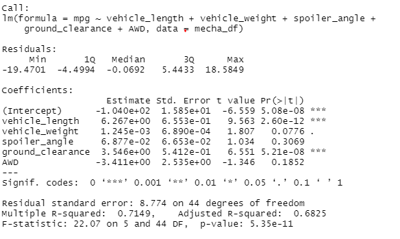
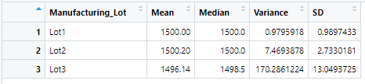
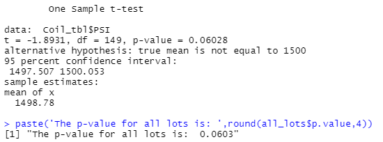
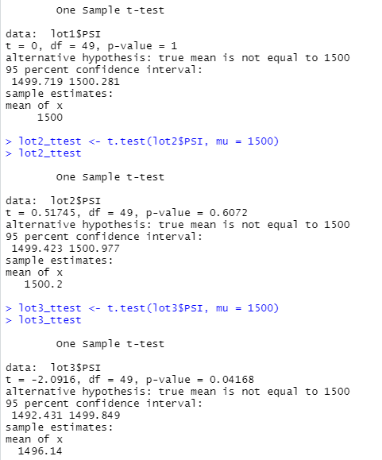
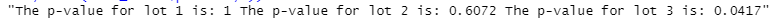

# MechaCar_Statistical_Analysis
The purpose of this analysis is to use R and statistical test to review car data for a car manufacturer MechaCar. The R script that calculates these values is here: [MechaCarChallenge](MechaCarChallenge.R)

## Linear Regression to Predict MPG
For the first analysis a multiple linear regression was used to see which variables related to miles per gallon. The variables examined were vehicle length, vehicle weight, spoiler angle, ground clearance and All Wheel drive. The results of the linear regression are shown in the image below.

Based on this, the intercept, vehicle length, and ground clearnace had a non-random amount of variance to the miles per gallon values in the provided data set. Since the p-value (5.35e-11) was less than the significance level of 0.05, we reject the null hypothesis in favor of the alternative that the slope is not zero. This regression is fairly effecive at predicting the mpg, it accounts for about 70% of mpg value, based on the R-squared value of 0.7149, however, there is still variation that is not accounted for based on this regression.

## Summary Statistics on Suspension Coils
The second analysis for MechaCar was to evaluate the PSI variance of the suspension coils. The design specifications for the MechaCar suspension coils dictate that the variance of the suspension coils must not exceed 100 pounds per square inch. This was evaluated by looking at all the data grouped together, as well as by each lot individually. The summary statistics for the combined data is shown below.

This shows an overall variance of 62.2, which is within the 100 PSI limit. The summary statistics for the lots individually are shown below.

This shows that Lots 1 and 2 meet the specification, because their variances are less than 100. However, Lot 3 does not meet the requirements since the variance is 170.

## T-Tests on Suspension Coils
The third analysis performed for MechaCar was to look at the mean PSI for the suspension coils compared to the required specification of 1500. This was done by performing a 1 sample t-test with all the lot data combined, and then 3 additional 1 sample t-tests were performed comparing each of the lots to the specification. The t-test results for the combined lot data is shown below. When all lot data was combined, the p-value of the t-test was 0.0603. This is higher than the significance level of .05, therefore we cannot reject the null hypothesis that the mean is 1500. 

The t-test results for the individual lots are shown below. Lots 1 and 2 have a p-value higher than the significance level (1 and 0.6072 respectively). So, again we cannot reject the null hypothesis. Lot 3 however has a p-value of .0417, lower than the significance level, which means we should reject the null hypothesis in favor of the alternative that the mean does not equal 1500. Based on this, while the combined lots meet the specification, lot 3 individually does not meet the specification.

## Study Design: MechaCar vs Competition
Write a short description of a statistical study that can quantify how the MechaCar performs against the competition. In your study design, think critically about what metrics would be of interest to a consumer: for a few examples, cost, city or highway fuel efficiency, horse power, maintenance cost, or safety rating.

In order for a study to be designed, we must determine who the customer is and what is important to the customer. For this analysis, we will make the assumption that this new MechaCar is intended to be a family car. In this case, increased safety, increased fuel efficiency, and lower cost will be important to the customer.

Each of these tests would be a one-tailed, one-sample t-test comparing the MechaCar against the overall car population.

Safety can be broked down into crashworthiness and crash prevention. Using this, the following are possible Null and Alternative hypotheses.

Null: The mean safety rating for crashworthiness is equal or less than the population mean of cars in this class.
Alternative: The mean safety rating for crashworthiness is greater than the population mean of cars in this class.

Null: The mean safety rating for crash prevention is equal or less than the population mean of cars in this class.
Alternative: The mean safety rating for crash prevention is greater than the population mean of cars in this class.

One-tailed, one-sample t-tests would be used to test this. A one-sample test would be used because we are comparing the test mean against an overall population-all cars in the class. It would be one-tailed because we want to show that the safety rating is greater, not just that it is different. If there is one specific competitor that MechaCar would like to show a competitive advantage over, a two-sample t-test would be appropriate.

In order to test this, the MechaCar safety data and the population safety data would be needed. IIHS crashworthiness test results for the MechaCar as well as the results for all cars in the same class.

